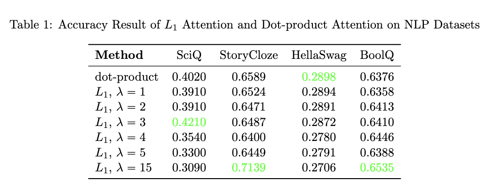
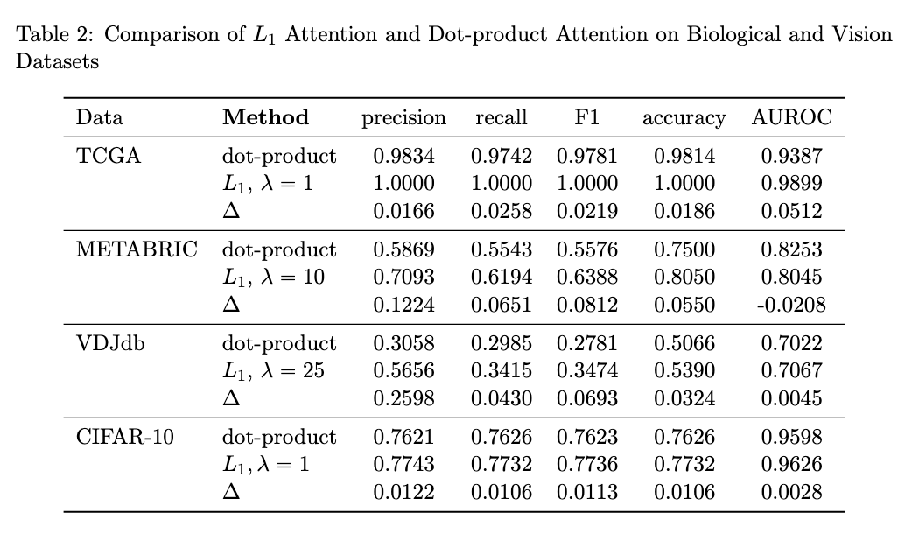

# EcoTransformers

We propose a new Transformer architecture "EcoTransformer", replacing dot-product attention with a convolutional mechanism using Laplacian kernels, the L1 metric between queries and keys, eliminating costly matrix multiplication operations. 

The typical scaled dot-product attention mechanism used throughout contemporary AI is computationally expensive and consumes a significant  amount of energy. Our new attention score calculation is lightweight and efficient: it removes resource-hungry multiplications, while performing on par with, or even surpassing scaled dot-product attention in NLP, bioinformatics, and vision tasks. 

## Structure

The core library is contained in l1_distance.py, containing the main functionality and any necessary helper functions. We tested our architecture against the typical eager_attention_forward used in GPT2, so classes inheriting from GPT2 have been provided to demonstrate how EcoTransformer's L1 attention can replace dot-product attention at minimal cost.

## Setup
Run the following commands in a bash terminal:
```
git clone https://github.com/xingmingxu/EcoTransformer_Temp.git
cd EcoTransformer_Temp
```
Create a fresh environment.
```
python -m venv .venv
```
Activate the virtual environment (the following demonstrates Linux, MacOS)
```
source .venv/bin/activate # in Linux, MacOS
```
Install the requirements.
```
pip install requirements.txt
```

## Run

It is best to run these tests on a device with access to a GPU. A .ipynb file is provided that can be run 

## Datasets

We tested our model on the following NLP, Biological, and Vision datasets:
* **NLP**: SciQ, StoryCloze, HellaSwag, BoolQ
* **Biological/Vision**: TCGA, METABRIC, VDJdb, CIFAR-10

## Our Results

Our EcoTransformer performs on-par with, or even surpassing scaled dot-product attention on the datasets described above. 


